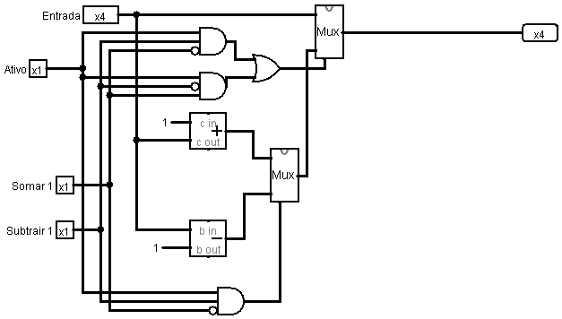
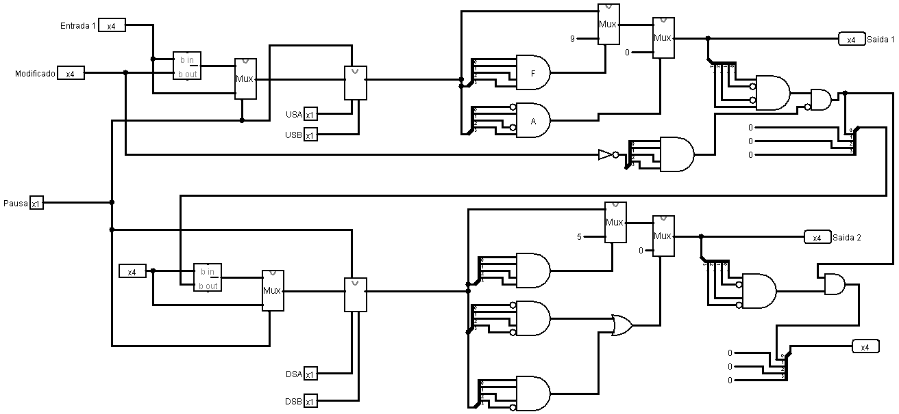
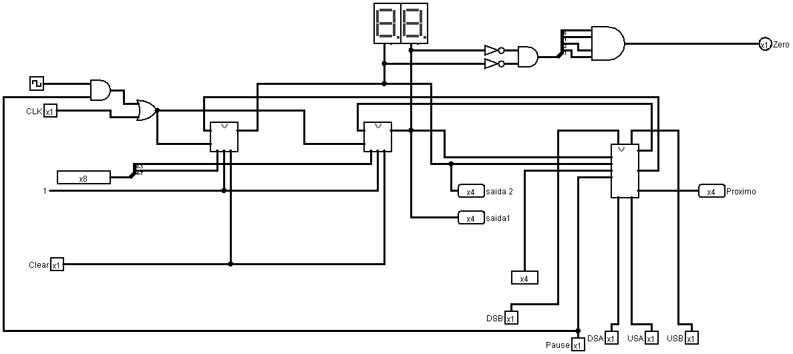
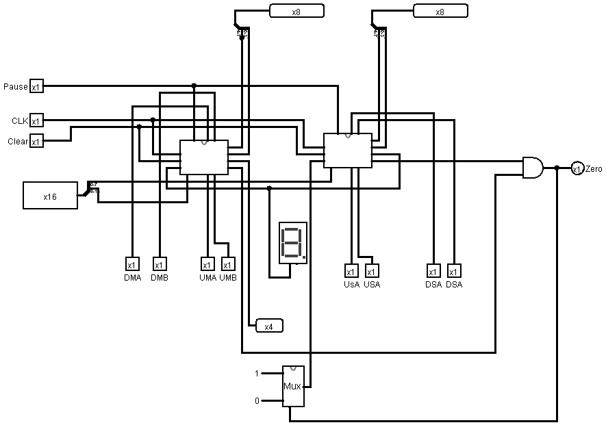
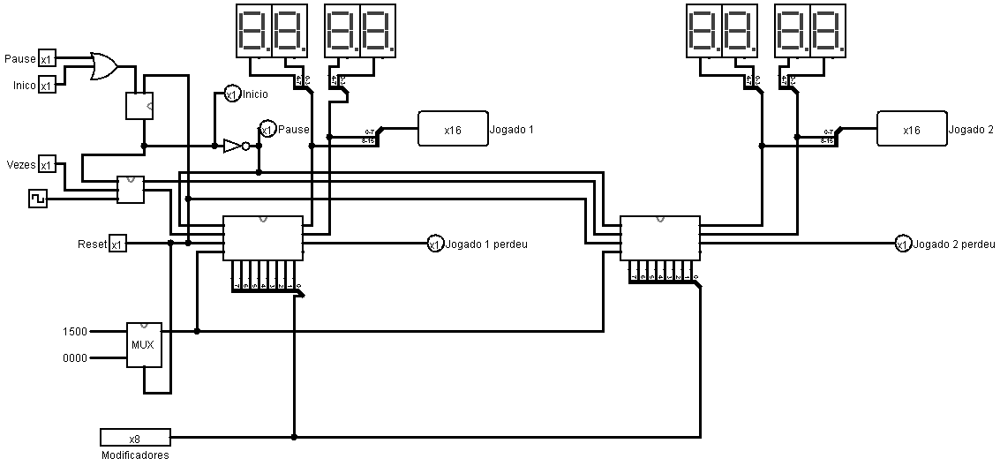
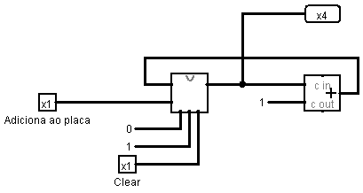
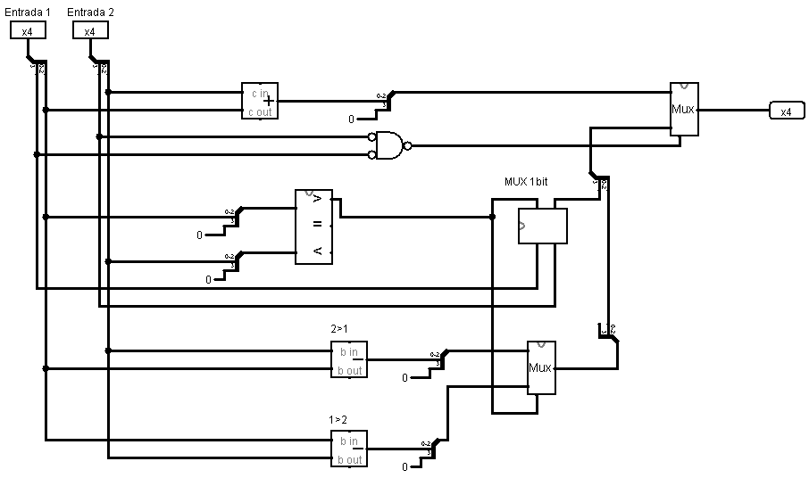
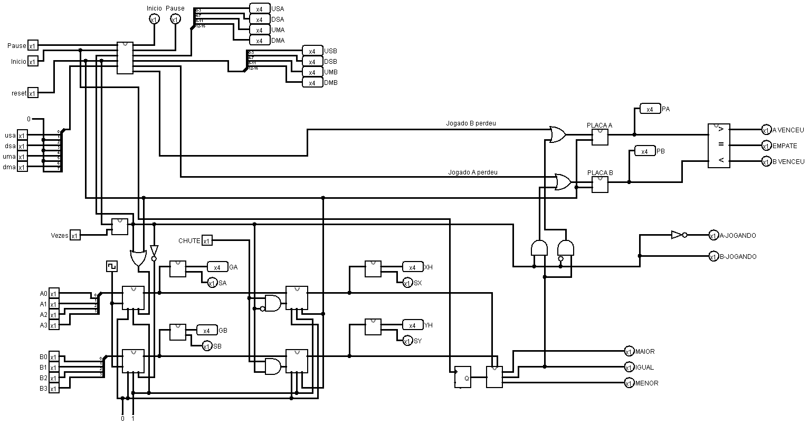

# Descrição 

Este trabalho foi desenvolvido durante a disciplina de Circuitos Digitais, ministrada por Ramon Nepomuceno [Ramon Nepomuceno](https://github.com/ramonn76) na Universidade Federal do Cariri (UFCA).

Consiste em um jogo em que os jogadores têm que adivinhar um número secreto. Para iniciar o jogo, clique no botão "Jogar" em 1. Depois disso, basta ficar apertando o botão do jogador, e o jogo indicará se o seu palpite é maior, menor ou igual. Se for igual, você acertou, obtendo o resultado final.

# Funcionamento 

## Cromometro

Antes de iniciar a falar sobre o cronômetro, é necessário explicar dois circuitos que foram usados no cronômetro, que são o "cronômetro somador" e o "cronômetro modificado".

### modificado cronometro

O cronômetro modificado recebe um número de 4 bits e pode subtrair 1 ou somar 1 quando ativado.

### somado cronometro

Recebe 2 números de 4 bits que são do cronômetro. Para o primeiro, a restrição é que ele deve ficar entre 0 e 9, e toda vez que chegar a zero, ele subtrairá um do próximo. O segundo número deve ficar restrito entre 0 e 5 e só diminuirá quando o primeiro número chegar a zero. Se a pausa estiver ativada, a subtração não é realizada.

### cronometro 8bits

São dois registradores de 4 bits e o "cronômetro somador".

### cronometro 16 bits

São dois cronômetros de 8 bits, que representam os minutos e segundos..

### cronometro 
São dois cronômetros de 16 bits, um para o jogador A e outro para o jogador B. Também definem o tempo inicial de 15 minutos.

### placa 

É um registrador de 4 bits que soma 1 toda vez que for acionado.

### Adição 

Soma dois números levando em consideração o sinal, que é representado pelo primeiro bit.

### operação maior 

Soma os dois números e compara com o número oculto para verificar se é maior, menor ou igual.

### jogo 

Junta todos os componentes para gerar o jogo.

